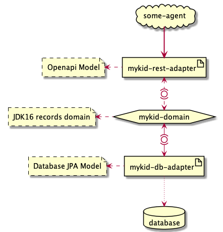
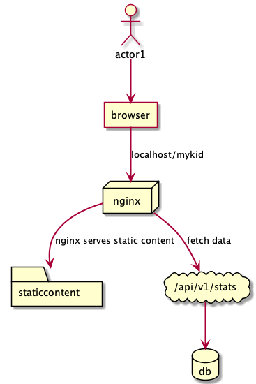
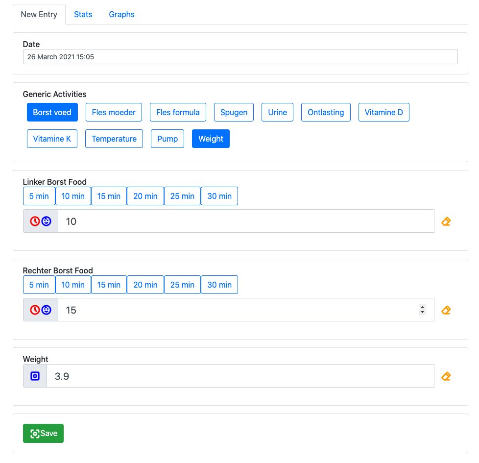
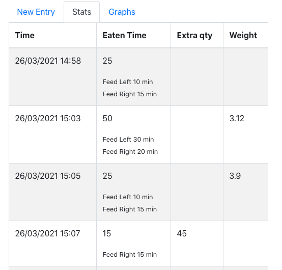
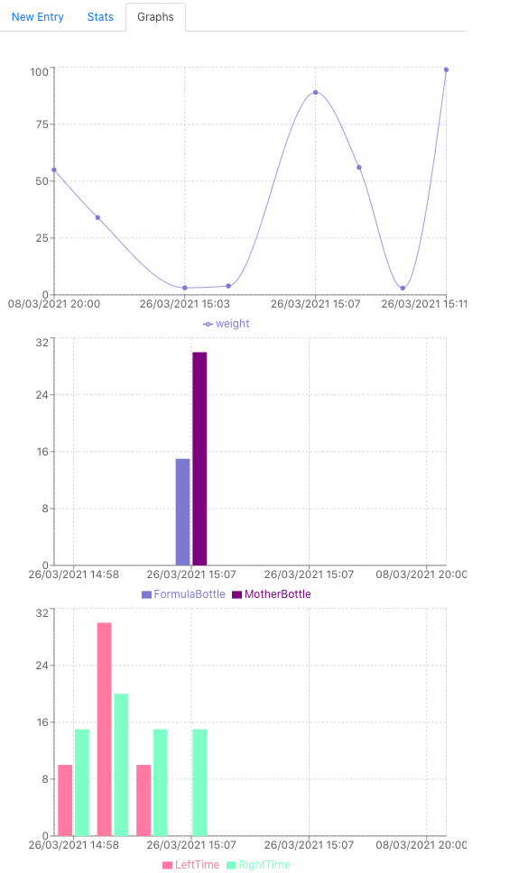

This is a reactjs based project with a spring boot backend running with openapi 3.0 and java 16.

### prerequisites
```bash
$> nvm list
v10.14.2
```

```bash
$> mvn -v
Apache Maven 3.5.2
```

```bash
$> java -version
openjdk version "16" 2021-03-16
```

```bash
$> docker -v
Docker version 20.10.5
```

```bash
$> docker-compose -v
docker-compose version 1.28.5
```

### build

```bash
$> cd react-client
$> npm install
$> npm run start
```

```bash
$> cd spring-boot-server
$> mvn clean install
```

Go to root repository folder
```bash
$> docker build . -t mykid-service:0.0.1

$> docker images
REPOSITORY        TAG                      IMAGE ID       CREATED         SIZE
mykid-service     0.0.1                    064000d92bae   4 seconds ago   534MB
```

By default we use the `react-client/build` folder for the `nginx` static files. One must build the FE before using this setup.
Alternatively, use the `docker-compose -f docker-compose-react-dev.yml/docker-compose-server-dev.yml up` for frontend/backend respectively.

```bash
$> docker-compose up
```

### playground with hexagonal architecture



### deployment components



### app screenshots


